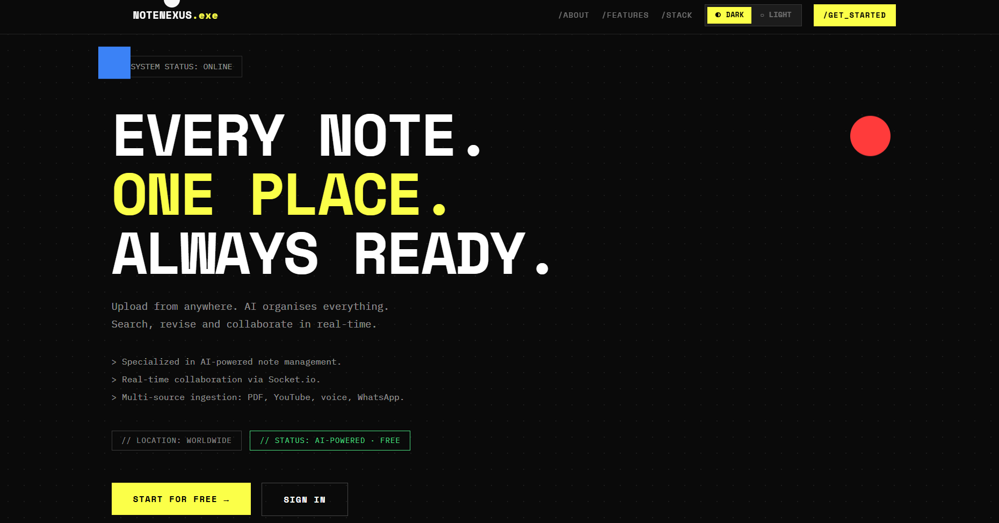
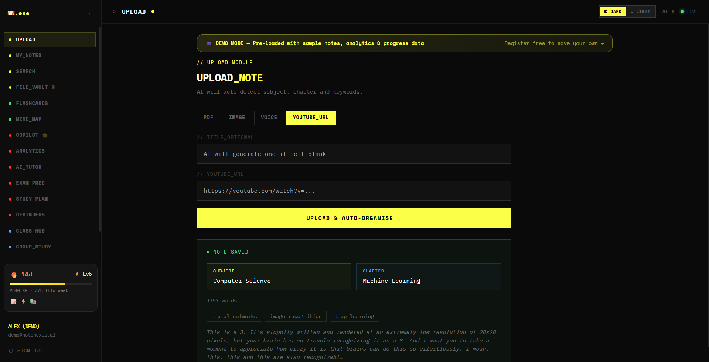
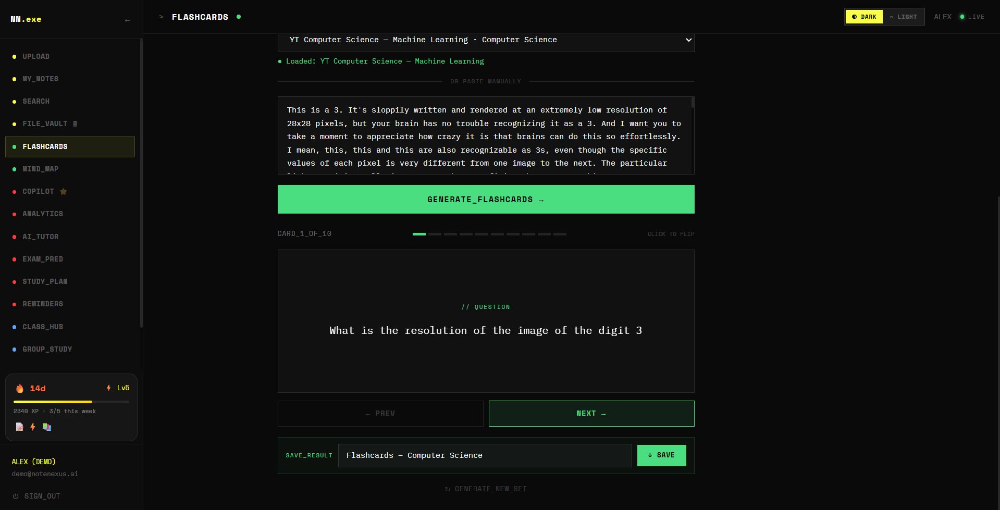
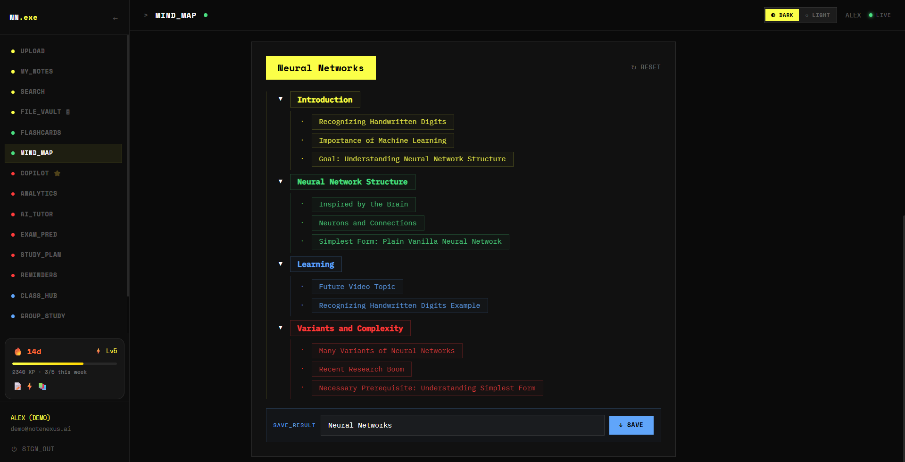
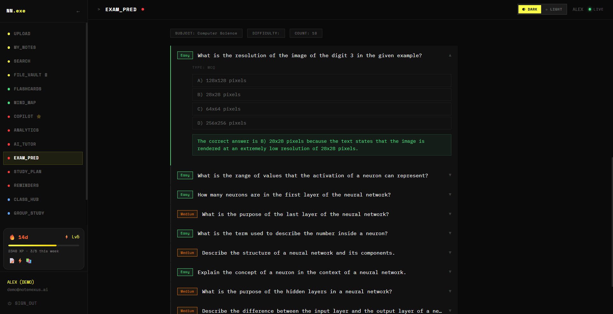
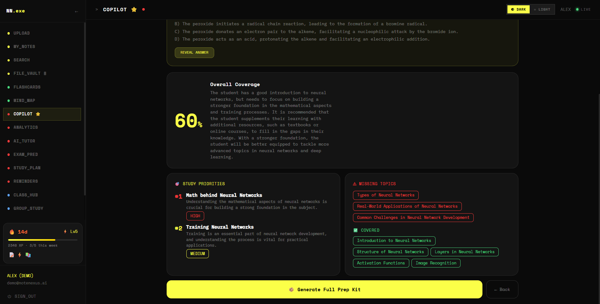
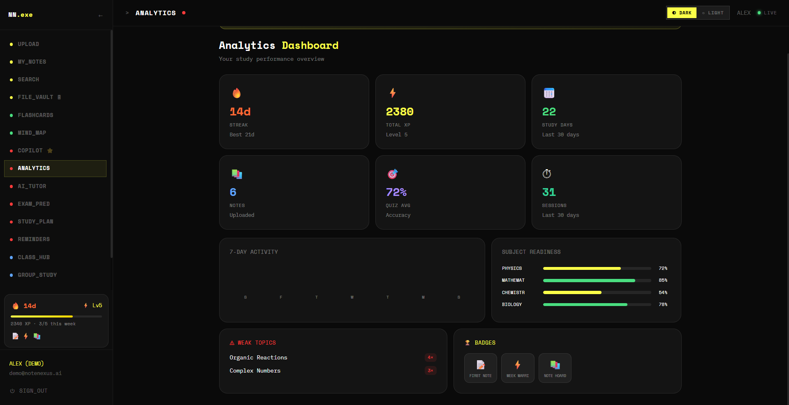
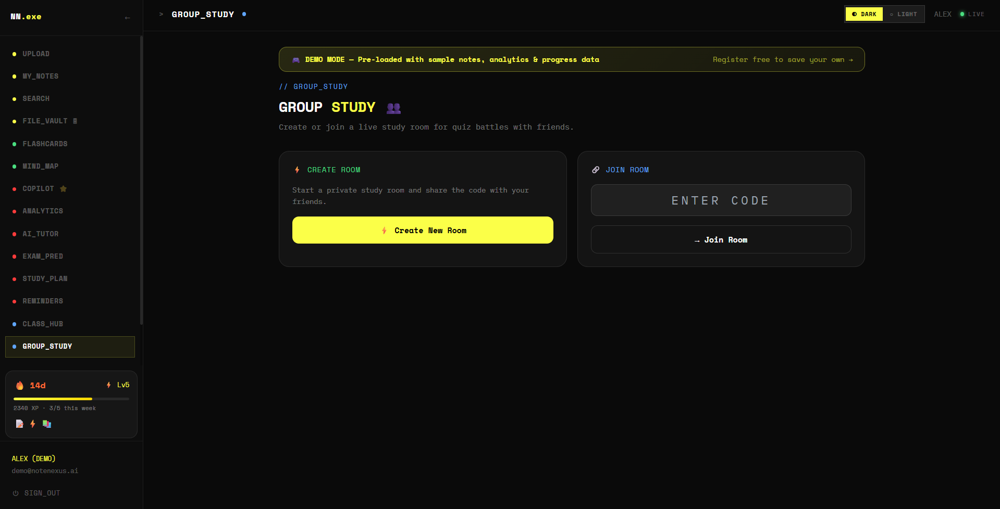
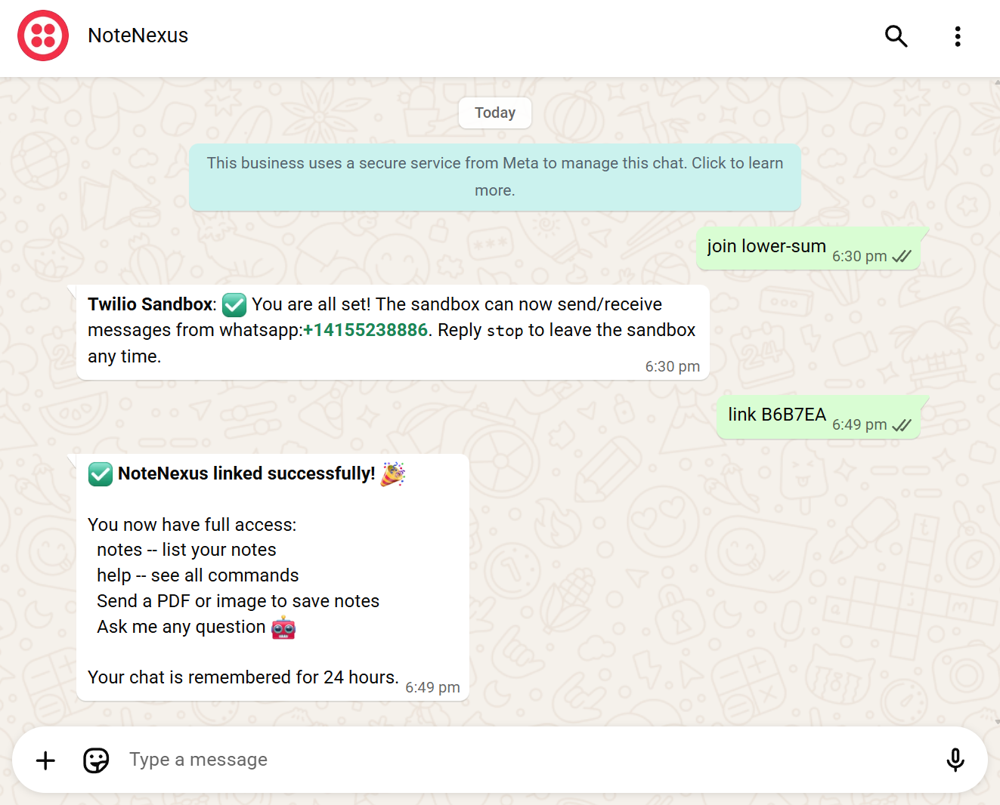
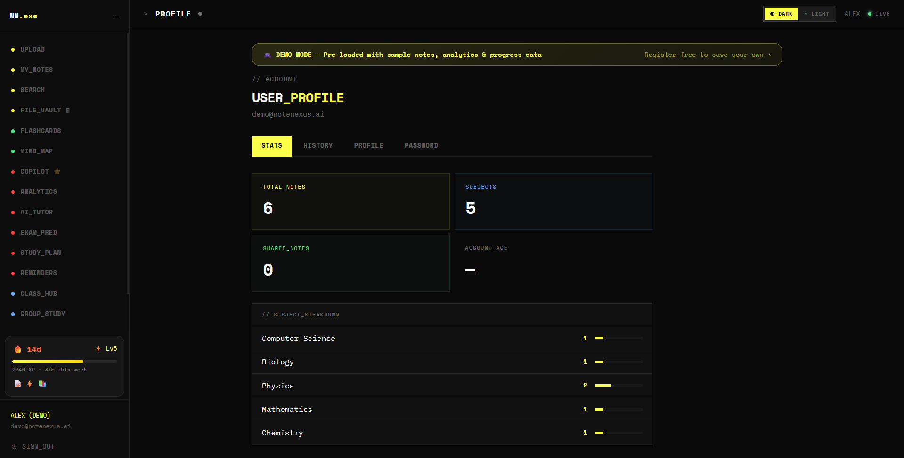

<div align="center">


# 🧠 NoteNexus

### *Your notes. Every source. One AI-powered hub.*

> The unified knowledge platform that transforms PDFs, YouTube videos, voice recordings,
> images, and WhatsApp messages into an intelligent, searchable, and collaborative study engine.

<br/>

[](https://notenexus-azure.vercel.app)

<br/>

<!-- ─── Frontend ─────────────────────────────────────────────────── -->
**Frontend**


<!-- ─── Backend ──────────────────────────────────────────────────── -->
**Backend**


<!-- ─── Database & Storage ───────────────────────────────────────── -->
**Database & Storage**


<!-- ─── AI & APIs ────────────────────────────────────────────────── -->
**AI & Integrations**


<!-- ─── DevOps ───────────────────────────────────────────────────── -->
**Deployment**


</div>

<br/>

---

## 🚀 Live Demo

<div align="center">

### [**https://notenexus-azure.vercel.app**](https://notenexus-azure.vercel.app)



*No sign-up required — use the demo account below to explore every feature instantly.*

</div>

<br/>

| Field | Value |
|:---|:---|
| 📧 **Demo Email** | `demo@notenexus.ai` |
| 🔑 **Demo Password** | `Demo@NoteNexus2024!` |

> The demo account is pre-seeded with notes, flashcards, study plans, and analytics data — everything populated and ready to explore.

---

## 📌 Problem Statement

Students today are drowning in **fragmented knowledge** scattered across multiple formats and platforms:

| Source | Problem |
|:---|:---|
| 📄 PDF lecture slides | Cannot be searched or queried intelligently |
| 🎥 YouTube lectures | Watched once, never revisited |
| 📸 Handwritten notes | Locked in images with no searchable text |
| 🎙️ Voice recordings | Hours of audio with no transcription |
| 💬 WhatsApp study groups | Buried in chat history, impossible to retrieve |

**The consequence:** Hours wasted re-reading material, no connection between sources, and revision that becomes guesswork rather than science.

---

## 📸 Screenshots

<div align="center">

| | |
|:---:|:---:|
|  |  |
| **Multi-Source Note Upload** | **AI Flashcard Generation** |
|  |  |
| **AI Mind Map** | **Exam Predictor** |
|  |  |
| **Study Copilot & Coverage Analysis** | **Analytics Dashboard** |
|  |  |
| **Group Study Rooms** | **WhatsApp AI Bot** |
|  | |
| **User Profile & Subject Breakdown** | |

</div>

---

## 💡 Solution

NoteNexus is a **unified AI knowledge hub** that ingests content from every source a student uses, extracts and structures it automatically, and overlays a full suite of AI-powered study tools — semantic search, flashcards, mind maps, exam prediction, personalized study planning, and real-time collaborative study rooms.

**The core innovation** is a multi-stage ingestion pipeline capable of extracting text from *any* format — including fully scanned PDFs, non-English handwriting, and geo-blocked YouTube transcripts — backed by a RAG (Retrieval-Augmented Generation) engine that grounds every AI answer directly in *your own* notes.

---

## 🛠️ Tech Stack

### 🖥️ Frontend

| Technology | Version | Purpose |
|:---|:---:|:---|
|  **Next.js** | 14.2.5 | React framework — App Router, SSR, file-based routing |
|  **React** | 18 | UI rendering |
|  **TypeScript** | 5 | Full type safety across the codebase |
|  **Tailwind CSS** | 3.4 | Utility-first styling |
|  **Framer Motion** | 11 | Animations and page transitions |
| **Zustand** | 4.5 | Lightweight global state (auth + theme) |
|  **Socket.io Client** | 4.7 | Real-time bidirectional communication |
| **Axios** | 1.7 | HTTP client with retry wrapper |
| **React Dropzone** | 14 | Drag-and-drop file upload UI |
| **React Hot Toast** | 2.4 | Toast notification system |

### ⚙️ Backend

| Technology | Version | Purpose |
|:---|:---:|:---|
|  **Node.js** | ≥ 18 | Server runtime |
|  **Express** | 4.19 | REST API framework — 16 route modules |
|  **Socket.io** | 4.7 | WebSocket server — rooms, quiz, typing indicators |
| **Multer + Cloudinary Storage** | — | Streaming file upload pipeline |
| **Nodemailer** | 6.9 | Email delivery for revision reminders |
| **node-cron** | 3.0 | Scheduled reminders + self-keepalive ping |
| **bcryptjs** | 2.4 | Password hashing |
| **jsonwebtoken** | 9.0 | JWT auth (7-day expiry) |
| **Helmet** + **Morgan** | — | Security headers + HTTP request logging |

### 🗄️ Database & Storage

| Technology | Purpose |
|:---|:---|
|  **MongoDB Atlas** | Primary datastore — 8 Mongoose schemas (users, notes, rooms, sessions…) |
| **Pinecone** — 768-dim · cosine · serverless | Vector database for semantic note retrieval |
|  **Cloudinary CDN** | File and image storage with global edge delivery |

### 🤖 AI & Integrations

| Service | Model | Purpose |
|:---|:---|:---|
|  **Groq** | `llama-3.3-70b-versatile` | Flashcards, exam prediction, study planner, AI tutor, copilot, translation |
| **Groq** | `whisper-large-v3` | Voice and audio transcription |
| **Groq Vision** | `llama-4-scout-17b-16e-instruct` | Image OCR — fallback stage 1 |
|  **Google Gemini** | `text-embedding-004` | 768-dim note embeddings stored in Pinecone |
| **Google Gemini** | `gemini-1.5-flash` | PDF text extraction — fallback stage 3 |
| **Tesseract.js** | — | Local OCR — fallback stage 2 |
|  **Twilio** | WhatsApp API | WhatsApp AI study bot (open + linked mode) |
| **yt-dlp → Supadata → youtubei.js** | — | 3-strategy YouTube transcript cascade |
| **Gmail / SMTP** | — | Revision reminder email delivery |

### ☁️ DevOps & Deployment

| Service | Purpose |
|:---|:---|
|  **Vercel** | Frontend hosting — automatic CI/CD on every push |
|  **Render** | Backend hosting — Node runtime, Oregon region |
| **PWA** (manifest + service worker) | Mobile-installable, offline-capable experience |

---

## ⚙️ Features

### 🔵 Note Ingestion & Management


- **Universal multi-source upload** — PDF, image (JPG/PNG), YouTube URL (all 4 link formats), voice/audio, plain text, WhatsApp
- **4-stage OCR fallback for PDFs** — `pdf-parse` → `canvas + Groq Vision` → `Tesseract.js` → `Gemini 1.5 Flash` — handles scanned, encrypted, and image-only documents
- **3-strategy YouTube transcript cascade** — `yt-dlp` → `Supadata API` → `youtubei.js Innertube` — bypasses cloud IP geo-blocks that break every standard approach
- **Auto language detection & translation** — detects any language, translates to English via Groq before ingestion
- **AI subject & chapter classification** — every note is auto-tagged (e.g. `Physics → Newton's Laws`) with keyword extraction
- **File Vault** — persistent file library separate from the notes index

### 🟢 Revision Tools

|  |  |
|:---:|:---:|
| **Flashcards** | **Mind Map** |

- **Flashcards** — one-click AI generation of 10 Q&A cards from any note
- **Mind Map** — AI-generated hierarchical visual knowledge tree rendered from note content
- **Saved Items Panel** — bookmark notes, flashcards, and questions for fast retrieval

### 🟡 AI Study Tools

|  |  |
|:---:|:---:|
| **Study Copilot & Coverage Analysis** | **Exam Predictor** |

- **Study Copilot** — RAG-powered chat that answers questions grounded in *your own notes* (Pinecone semantic retrieval with 0.6 relevance threshold, 16-message history window)
- **AI Tutor** — contextual tutoring at Beginner / Intermediate / Advanced levels
- **Exam Predictor** — generates MCQ, short answer, and long answer questions with model answers and difficulty classification (Easy / Medium / Hard)
- **Study Planner** — AI builds a day-by-day revision schedule from your subjects, exam date, daily hours, and weak topics — includes built-in rest days and past-paper sessions
- **Revision Reminders** — cron-scheduled email reminders via Nodemailer / Gmail SMTP
- **Semantic Search** — natural language queries across all notes via Pinecone vector similarity (top-8 results)

### 🔴 Collaboration


- **Class Hub** — shared note board with live upvotes, real-time new-note alerts, and typing indicators via Socket.io
- **Group Study Rooms** — join via 6-character code, live member list, in-room AI quiz with real-time leaderboard — all Socket.io powered

### 🟣 WhatsApp AI Bot


- **Open mode** — anyone messages the Twilio number and gets instant AI replies; 20-message context persists per phone number with 24-hour TTL auto-expiry
- **Linked mode** — connect a NoteNexus account for note-aware answers, note listing, and PDF/image ingestion directly over WhatsApp

### 🟠 Gamification & Analytics

|  |  |
|:---:|:---:|
| **Analytics Dashboard** | **User Profile** |

- **XP & Levelling** — earn XP for uploads, quizzes, and study sessions; 500 XP per level with progress bar
- **Badges** — First Note 📝 · 3-Day Streak 🔥 · Week Warrior ⚡ · Month Master 🏆 · Quiz Master 🎯 · Note Hoarder 📚 · AI Pilot 🤖 · Team Player 👥
- **Streak tracking** — current streak, longest streak, last study date
- **Performance Dashboard** — subject readiness scores, weak-topic breakdown, study session history, weekly goal progress

### ⚪ Infrastructure & UX

- **Dark / Light theme** — smooth toggle, Zustand-persisted across sessions
- **PWA** — service worker + web manifest for mobile installability and offline support
- **Plan gating** — free / pro / team tiers via `checkPlan` middleware (all features unlocked on free for demo)
- **Demo mode** — pre-seeded environment, one-click access via credentials
- **Self-keepalive cron** — pings Render backend every 14 minutes to prevent free-tier cold starts

---

## 🧩 System Architecture

```
┌─────────────────────────────────┐
│      CLIENT  ·  Browser / PWA   │
│  Next.js 14 · React 18 · Zustand│
└────────┬────────────────┬───────┘
         │ REST (Axios)   │ WS (Socket.io)
         ▼                ▼
┌─────────────────────────────────┐
│   API SERVER · Express + Node   │
│                                 │
│  Route Modules (16)             │
│  /auth /notes /search /copilot  │
│  /tutor /exam /planner /rooms   │
│  /gamification /whatsapp ...    │
│                                 │
│  ingestionService  (4-stage OCR)│
│  aiService         (Groq+Gemini)│
│  vectorService     (Pinecone)   │
│  reminderService   (cron)       │
│  socketHandler     (rooms/quiz) │
└──┬──────┬──────┬──────┬────┬───┘
   ▼      ▼      ▼      ▼    ▼
MongoDB Pinecone Cloud  Groq Gemini
Atlas   768-dim  inary  LLaMA Embed
               CDN   Whisper PDF OCR
                         │
                   Twilio WhatsApp
                   Gmail SMTP
```

### Data Flow — Note Upload

```
User uploads file  ──or──  pastes YouTube URL
              │
              ▼
┌─────────────────────────────────┐
│         ingestionService        │
│                                 │
│  PDF   → pdf-parse              │
│        → canvas + Groq Vision   │
│        → Tesseract.js           │
│        → Gemini 1.5 Flash       │
│  Image → Groq Vision            │
│        → Tesseract.js           │
│  YT    → yt-dlp                 │
│        → Supadata API           │
│        → youtubei.js            │
│  Voice → Groq Whisper           │
└──────────────┬──────────────────┘
               │  raw text
               ▼
┌─────────────────────────────────┐
│           aiService             │
│  1. Detect language → translate │
│  2. Classify Subject + Chapter  │
└──────┬───────────────┬──────────┘
       ▼               ▼
  MongoDB Atlas    vectorService
  Note document    Gemini embed
  + metadata       → Pinecone
```

---

## 📂 Project Structure

```
notenexus/
├── frontend/                   # Next.js 14 (Vercel)
│   ├── public/
│   │   ├── manifest.json       # PWA manifest
│   │   └── sw.js               # Service worker
│   └── src/
│       ├── app/
│       │   ├── page.tsx        # Landing page
│       │   ├── layout.tsx      # Root layout
│       │   ├── dashboard/
│       │   │   └── page.tsx    # 16 feature tabs
│       │   ├── sign-in/
│       │   └── sign-up/
│       ├── components/
│       │   ├── notes/
│       │   │   ├── UploadNote.tsx
│       │   │   ├── NotesList.tsx
│       │   │   ├── SearchBar.tsx
│       │   │   └── ClassHub.tsx
│       │   ├── revision/
│       │   │   ├── Flashcards.tsx
│       │   │   └── MindMap.tsx
│       │   ├── StudyCopilot.tsx
│       │   ├── AiTutor.tsx
│       │   ├── ExamPredictor.tsx
│       │   ├── StudyPlanner.tsx
│       │   ├── GroupStudy.tsx
│       │   ├── WhatsAppBot.tsx
│       │   ├── FileVault.tsx
│       │   └── PerformanceDashboard.tsx
│       ├── hooks/
│       │   ├── useSocket.ts
│       │   └── useTracking.ts
│       └── lib/
│           ├── api.ts
│           ├── store.ts        # Zustand (auth + theme)
│           └── fetchWithRetry.ts
│
└── backend/                    # Express API (Render)
    ├── server.js               # Entry point
    ├── routes/                 # 16 route modules
    │   ├── auth.js
    │   ├── notes.js
    │   ├── search.js
    │   ├── copilot.js
    │   ├── tutor.js
    │   ├── examPredictor.js
    │   ├── studyPlanner.js
    │   ├── revision.js
    │   ├── reminders.js
    │   ├── rooms.js
    │   ├── gamification.js
    │   ├── analytics.js
    │   ├── filevault.js
    │   ├── whatsapp.js
    │   ├── savedItems.js
    │   └── demo.js
    ├── models/                 # 8 Mongoose schemas
    │   ├── User.js
    │   ├── UserProfile.js
    │   ├── Note.js
    │   ├── GroupRoom.js
    │   ├── StudySession.js
    │   ├── Reminder.js
    │   ├── SavedItem.js
    │   ├── FileVault.js
    │   └── WhatsAppConversation.js
    ├── services/
    │   ├── aiService.js
    │   ├── ingestionService.js
    │   ├── vectorService.js
    │   └── reminderService.js
    ├── middleware/
    │   ├── auth.js
    │   ├── checkPlan.js
    │   └── trackActivity.js
    ├── socket/index.js
    ├── config/
    │   ├── db.js
    │   └── cloudinary.js
    └── utils/
        ├── groq.js
        └── logger.js
```

---

## 🧪 Running Locally

### Prerequisites

| Tool | Minimum Version |
|:---|:---:|
| Node.js | 18.0.0 |
| npm | 9.0.0 |
| MongoDB Atlas | Free cluster |
| Pinecone | Free serverless index — **768 dims · cosine** |
| yt-dlp | Latest (`pip install yt-dlp`) |

### Installation

```bash
# Clone the repository
git clone https://github.com/Vishwajitsingh-rajput-27/notenexus.git
cd notenexus

# Install backend dependencies
cd backend && npm install

# Install frontend dependencies
cd ../frontend && npm install
```

### Configuration

```bash
# Backend
cp backend/.env.example backend/.env

# Frontend
cp frontend/.env.example frontend/.env.local
```

Fill in all values as described in the [Environment Variables](#-environment-variables) section below.

### Start

```bash
# Terminal 1 — API Server  →  http://localhost:5000
cd backend && npm run dev

# Terminal 2 — Frontend    →  http://localhost:3000
cd frontend && npm run dev
```

### Seed Demo Data *(optional)*

```bash
cd backend && node scripts/seedDemo.js
```

---

## 🔐 Environment Variables

### Backend — `backend/.env`

| Variable | Required | Description |
|:---|:---:|:---|
| `MONGODB_URI` | ✅ | MongoDB Atlas connection string |
| `JWT_SECRET` | ✅ | Long random string for JWT signing |
| `JWT_EXPIRE` | ✅ | Token lifetime e.g. `7d` |
| `GROQ_API_KEY` | ✅ | Groq API key — powers all LLM features ([groq.com](https://groq.com)) |
| `GEMINI_API_KEY` | ✅ | Google Gemini — embeddings + PDF OCR ([ai.google.dev](https://ai.google.dev)) |
| `PINECONE_API_KEY` | ✅ | Pinecone API key ([pinecone.io](https://www.pinecone.io)) |
| `PINECONE_INDEX_NAME` | ✅ | Your Pinecone index name e.g. `notenexus` |
| `CLOUDINARY_CLOUD_NAME` | ✅ | Cloudinary cloud name |
| `CLOUDINARY_API_KEY` | ✅ | Cloudinary API key |
| `CLOUDINARY_API_SECRET` | ✅ | Cloudinary API secret |
| `TWILIO_ACCOUNT_SID` | ⚙️ | Twilio SID — required for WhatsApp bot |
| `TWILIO_AUTH_TOKEN` | ⚙️ | Twilio auth token |
| `TWILIO_WHATSAPP_NUMBER` | ⚙️ | e.g. `whatsapp:+14155238886` |
| `EMAIL_USER` | ⚙️ | Gmail address for revision reminders |
| `EMAIL_PASS` | ⚙️ | Gmail App Password (not your account password) |
| `BACKEND_URL` | ⚙️ | Deployed backend URL — activates self-keepalive cron |
| `FRONTEND_URL` | ⚙️ | Deployed frontend URL |
| `NODE_ENV` | — | `development` or `production` |
| `PORT` | — | Server port (default: `5000`) |
| `SUPADATA_API_KEY` | ➕ | Optional YouTube transcript fallback ([supadata.ai](https://supadata.ai)) |
| `DEMO_EMAIL` | ➕ | Demo account email |
| `DEMO_PASSWORD` | ➕ | Demo account password |

> **⚠️ Pinecone index must be:** 768 dimensions · cosine metric · serverless.
> An index with different dimensions will silently fail on upsert. Delete and recreate if unsure.

### Frontend — `frontend/.env.local`

| Variable | Required | Description |
|:---|:---:|:---|
| `NEXT_PUBLIC_API_URL` | ✅ | Backend API base URL e.g. `http://localhost:5000/api` |
| `NEXT_PUBLIC_SOCKET_URL` | ✅ | Backend Socket.io URL e.g. `http://localhost:5000` |

---

## 📸 User Journey

| Step | Action |
|:---:|:---|
| 1️⃣ **LAND** | Homepage → animated showcase → sign up in 30s |
| 2️⃣ **UPLOAD** | Drop PDF / paste YouTube URL / record voice |
| 3️⃣ **INGEST** | Extract → translate → classify Subject & Chapter |
| 4️⃣ **SEARCH** | Ask in plain English → Pinecone top 8 matches |
| 5️⃣ **REVISE** | One-click flashcards generated from any note |
| 6️⃣ **MAP** | Visual mind map rendered from note content |
| 7️⃣ **PLAN** | Enter exam date → AI builds revision schedule |
| 8️⃣ **PREDICT** | Exam Predictor → MCQ + short answers + answers |
| 9️⃣ **COPILOT** | Chat with AI grounded in your own notes (RAG) |
| 🔟 **COLLAB** | Group Study room → share code → live AI quiz |
| 1️⃣1️⃣ **WHATSAPP** | Link account → study from anywhere via WhatsApp |
| 1️⃣2️⃣ **TRACK** | Streaks · XP · Badges · Subject readiness |

### Dashboard Tabs

| Category | Tabs |
|:---|:---|
| 📁 **Notes** | `UPLOAD` · `MY_NOTES` · `SEARCH` · `FILE_VAULT` |
| 🔁 **Revision** | `FLASHCARDS` · `MIND_MAP` |
| 🤖 **AI Tools** | `COPILOT` · `ANALYTICS` · `AI_TUTOR` · `EXAM_PRED` · `STUDY_PLAN` · `REMINDERS` |
| 👥 **Collaboration** | `CLASS_HUB` · `GROUP_STUDY` |
| 💬 **Connect** | `WHATSAPP` |
| 👤 **Account** | `PROFILE` |

---

## 🌍 Scalability & Future Scope

### Why the Current Architecture Scales

| Layer | Scaling Property |
|:---|:---|
| **Pinecone serverless** | Auto-scales vector queries; namespaces isolate data per institution |
| **MongoDB Atlas** | Horizontal sharding-ready; TTL indexes in production (WhatsApp 24h expiry) |
| **Cloudinary CDN** | Global edge delivery, no platform storage ceiling |
| **Express API** | Stateless — horizontally scalable; Socket.io clusters via Redis adapter |
| **Groq inference** | Sub-second LLM latency at scale via dedicated hardware |

### Roadmap

| Priority | Feature |
|:---:|:---|
| 🔜 | Native mobile app (React Native) — zero backend changes required |
| 🔜 | Real-time collaborative note editor (CRDT-based) |
| 🔜 | Teacher / institution admin panel with class-wide note distribution |
| 🔄 | Spaced Repetition System (SRS) scheduler for flashcards |
| 🔄 | Multi-language UI — translation pipeline already exists |
| 🔄 | Full offline mode — PWA service worker foundation already in place |
| 🔮 | Google Classroom · Moodle · Microsoft Teams integration |
| 🔮 | Handwriting recognition for photographed notebook pages |
| 🔮 | AI-generated video summaries from lecture recordings |

---

## 💰 Business Potential

### Monetization

| Tier | Price | Highlights |
|:---|:---:|:---|
| **Free** | $0 / mo | Unlimited notes, all AI tools, 1 active study room |
| **Pro** | $5 / mo | Priority inference, advanced analytics, unlimited rooms |
| **Team** | $15 / mo | Admin panel, bulk upload, team analytics, SSO |

### Target Market

| Segment | Scale |
|:---|:---|
| 🎓 University & college students | ≈ 250 million globally |
| 🏫 Coaching institutes & tutoring centres | Class-scale note distribution and progress tracking |
| 🏢 Corporate L&D teams | Knowledge management from training materials |
| 🌏 Non-English speaking regions | Built-in translation opens SEA, MENA, LATAM markets |

### Market Relevance

The global EdTech market is valued at **$340B+**, growing at **≈16% CAGR**. NoteNexus sits at the intersection of AI productivity tooling and collaborative learning — two of the fastest-growing sub-sectors. The WhatsApp integration alone unlocks markets where WhatsApp is the primary communication platform, representing billions of potential users across India, Brazil, and Southeast Asia.

---

## 🏆 Hackathon Edge

| Differentiator | Why It Matters |
|:---|:---|
| **4-stage OCR fallback** | Handles every real-world PDF — scanned, encrypted, image-only. No other student tool does this robustly. |
| **3-strategy YouTube cascade** | Bypasses cloud IP blocks that defeat every standard API approach — including geo-restricted and caption-less videos. |
| **RAG Study Copilot** | Not ChatGPT in a wrapper — answers are semantically retrieved from *your own notes* via Pinecone, grounding responses in real content. |
| **Auto language detection + translation** | Upload notes in Hindi, Tamil, or Arabic — NoteNexus translates, embeds, and makes them searchable in English automatically. |
| **WhatsApp AI bot** | Zero app install. Meets students on the platform they already use every day. |
| **Production-deployed, not a prototype** | Live on Vercel + Render with real auth, real data, and a seeded demo — judges can use it right now. |
| **Real-time group quiz rooms** | Gamified quizzes with a live leaderboard via Socket.io — creates a social study loop that drives engagement. |
| **Full gamification layer** | XP, levels, streaks, and badges transform passive note-taking into an active daily habit. |

---

## 🤝 Contributing

Contributions are welcome. Here is how to get started:

```bash
# 1. Fork and clone
git clone https://github.com/Vishwajitsingh-rajput-27/notenexus.git
cd notenexus

# 2. Create a feature branch
git checkout -b feature/your-feature-name

# 3. Commit your changes
git add .
git commit -m "feat: describe your change clearly"

# 4. Push and open a Pull Request
git push origin feature/your-feature-name
```

**Good first issues:** `.docx` / `.pptx` ingestion support · spaced repetition scheduler · improved Mind Map renderer · Redis adapter for Socket.io clustering · mobile responsiveness improvements.

Please follow the existing code style, comment non-obvious logic, and test locally before submitting.

---

## 👨‍💻 Author

<div align="center">

### Vishwajitsingh Rajput

*Full-Stack Developer · Computer Engineer*

Indira College of Engineering and Management, Pune

<br/>

[](https://github.com/Vishwajitsingh-rajput-27)
[](https://instagram.com/vishwajit._.27)

</div>

---

<div align="center">

*Built with precision and passion — for every student who deserves smarter tools.*

<br/>

[](https://notenexus-azure.vercel.app)

</div>
